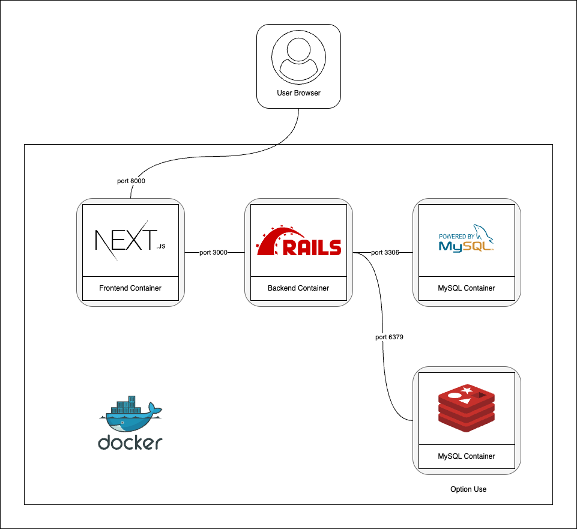

    

## 目次
- [1. 概要](#1.概要)
- [2. ローカル開発環境](#2.ローカル開発環境)
- [3. Frontendコンテナの初期Package](#3.Frontendコンテナの初期Package)
- [4. Backednコンテナの初期Gem](#4.Backednコンテナの初期Gem)
- [5. AWS環境](#5.AWS環境)
- [6. CI/CD](#6.CICD)

## 1.概要
---

本項目では、本リポジトリテンプレートを用いて展開されるローカル開発環境およびクラウド環境の詳細について示します。

 
 

## 2.ローカル開発環境
---

ローカル開発環境はDockerを用いて提供します。４つのコンテナから構成されており、下記の４つから構成されます。

* Frontendコンテナ
* Backendコンテナ
* MySQLコンテナ
* Redisコンテナ

 

 
 

## 3.Frontendコンテナの初期Package
---

FrontendコンテナはNext.jsをベースに、AppRouterに寄せたディレクトリ構成が起動します。
Frontendコンテナに含まれる初期Packageは下記の通りです。

| 種別           | パッケージ名     | 説明           |
|----------------|------------------|----------------|
| UIライブラリ      | @mui/material    | Material UI      |
| HTTPクライアント  | axios            | API通信          |
| テスト            | jest, ts-jest    | 単体テスト       |
| Lint/Format       | eslint, prettier | コード品質管理   |

 
 

## 4.Backednコンテナの初期Gem
---

BackendコンテナはRuby On Railsをベースに、APIモードで起動します。
Backendコンテナに含まれる初期Gemは下記の通りです。

| 種別           | パッケージ名     | 説明           |
|----------------|------------------|----------------|
| API            | rails              | APIモード       |
| DB             | mysql2, ridgepole  | DB管理         |
| 認証           | jwt, bcrypt        | トークン／パスワード管理 |
| バージョン管理 | paper\_trail       | データ履歴管理      |
| Job            | sidekiq            | バックグラウンドジョブ  |
| AWS            | aws-sdk-rails, ses | AWS連携        |

 
 

## 5.AWS環境
---

* コンテンツ準備中

 
 

## 6.CICD
---

* コンテンツ準備中

 
 

[PREVIOUS](./02_prerequisite.md)

[NEXT](./10_local_setup.md) 

[RETURN README](../../README.md)